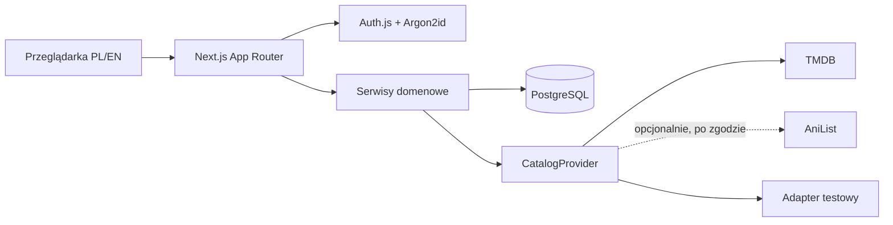
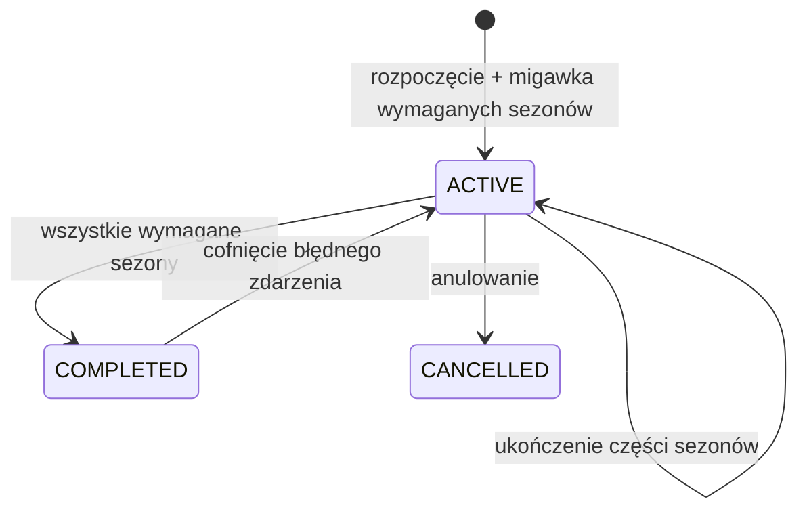
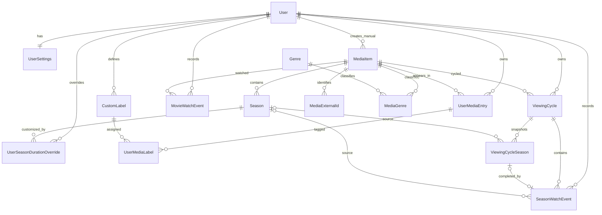

# Architektura MediaTracker

## Obraz całości

MediaTracker jest monolitem modułowym Next.js 16 z App Routerem. Server Components odczytują lokalne dane, Route Handlers wykonują walidowane mutacje, a czysta warstwa `src/lib/domain` oblicza cykle, fallback tytułów i statystyki. PostgreSQL jest jedynym trwałym magazynem danych użytkowników. Prisma 7 zapewnia schemat, migracje i parametryzowane zapytania.

Nie utworzono osobnego backendu, Edge Runtime ani zależności od SaaS. Build używa `output: standalone` i zwykłego Node.js.

## Autoryzacja i bezpieczeństwo

Auth.js używa dostawcy credentials i podpisanej sesji JWT w ciasteczku `HttpOnly`, `SameSite=Lax`, z `Secure` w produkcji. Hasła hashuje Argon2id (19 MiB, dwa przebiegi). Token zawiera wersję hasła, a callback sprawdza ją z bazą przy każdym odczycie sesji; zmiana hasła zwiększa wersję i unieważnia poprzednie sesje.

Każda prywatna mutacja pobiera `userId` z sesji i wyszukuje zasób przez `(id, userId)`. Identyfikator z klienta nigdy nie jest samodzielną podstawą autoryzacji. Rejestracja, logowanie i katalog mają trwałe limity w bazie. Własne endpointy mutujące sprawdzają origin, Zod i typ `application/json`. Nagłówki CSP, `X-Frame-Options`, `nosniff`, Referrer Policy i Permissions Policy są ustawiane globalnie.

## Model katalogu

`format` (`MOVIE`/`SERIES`) jest niezależny od `category` (`GENERAL`/`ANIME`). Anime może więc być filmem albo serialem. Zewnętrzne pozycje są współdzielonymi lokalnymi metadanymi; ręczny rekord ma `manualOwnerId` i nie jest globalny. `MediaExternalId(provider, externalId)` zapobiega duplikatom jednego dostawcy, ale nie łączy automatycznie dostawców.

## Cykle i czas

Film tworzy po jednym `MovieWatchEvent` dla każdego pełnego obejrzenia. Serial tworzy `ViewingCycle` z migawkami `ViewingCycleSeason`. Później dodany sezon nie modyfikuje tej migawki. `SeasonWatchEvent` może należeć do migawki cyklu albo być samodzielny.

Łączny czas jest sumą `durationMinutesSnapshot` z wydarzeń filmowych i sezonowych. Cykl nie dodaje osobnego czasu, więc nie występuje podwójne naliczanie. Migawka zachowuje również źródło czasu (`EXACT`, `ESTIMATED`, `MANUAL`, `UNKNOWN`) i przybliżoną liczbę odcinków.

Ręczna korekta czasu sezonu jest zapisywana w `UserSeasonDurationOverride`, a nie w globalnych metadanych. Wpływa wyłącznie na nowe zdarzenia i migawki danego użytkownika; inne konta oraz zapisane wcześniej zdarzenia pozostają niezmienione.

Statystyki są czystą funkcją nad znormalizowanymi wydarzeniami. Daty nieznane trafiają do sum całkowitych, lecz nie do map miesięcznych i rocznych. Podział anime ma pierwszeństwo przed formatem, dlatego anime-film nie jest jednocześnie liczony jako zwykły film.

## ERD

## Synchronizacja

1. Wyszukiwanie odpytuje aktywne adaptery równolegle i cache'uje stronę wyników.
2. Dodanie pobiera szczegóły oraz zapisuje lokalny `MediaItem`, gatunki i sezony.
3. Profil, dashboard i biblioteka nie odpytują dostawców.
4. Ręczne odświeżenie wykonuje upsert bieżących sezonów i ustawia `lastSyncedAt`.
5. Stare zdarzenia i migawki cykli pozostają nietknięte; brak rekordu u dostawcy nie usuwa danych lokalnych.

## Indeksy i usuwanie

Indeksy obejmują właściciela, status, aktywność, daty wydarzeń, format/kategorię/rok, gatunki i stan cyklu. Usunięcie użytkownika kaskadowo usuwa ustawienia, bibliotekę, etykiety, cykle i wydarzenia. PostgreSQL zapisuje znaczniki jako UTC.
